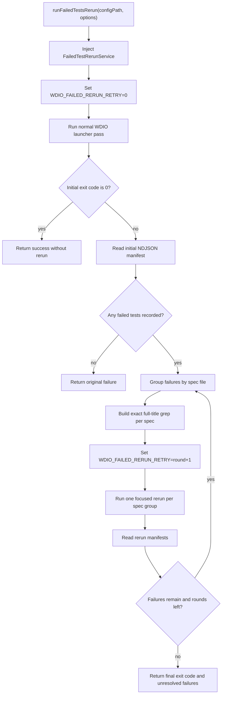
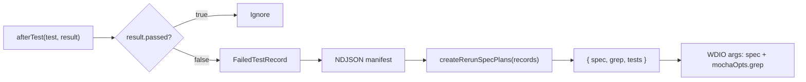

# @wdio/failed-rerun-runner

`@wdio/failed-rerun-runner` runs a normal WebdriverIO pass first, records tests that fail, and then starts focused rerun passes for only those failed tests.

The package is useful when you want a rerun step after the main run finishes, instead of framework-level retries during the test body.

## Usage

Run it from the CLI:

```sh
npx wdio-failed-rerun-runner run ./wdio.conf.ts
```

CLI options:

- `--max-reruns <count>`: maximum focused rerun rounds. Defaults to `1`.
- `--no-pass-on-successful-rerun`: keep the initial failing exit code even when focused reruns pass.
- `--manifest-path <path>`: write the initial-run failure manifest to a known path.
- `--rerun-manifest-path <path>`: write rerun failure manifests to a known path.

## Example

Run an initial test suite with up to two focused rerun rounds and store manifest files:

```sh
npx wdio-failed-rerun-runner run ./wdio.conf.ts \
  --max-reruns 2 \
  --manifest-path ./artifacts/initial-failures.ndjson \
  --rerun-manifest-path ./artifacts/rerun-failures.ndjson
```

If two tests failed in the first run, only those specs/titles are rerun:

```json
{
  "attempt": "initial",
  "framework": "mocha",
  "spec": "./test/specs/login.spec.ts",
  "fullTitle": "login flow should login with valid credentials"
}
```

Or call the public API from Node.js:

```ts
import { runFailedTestsRerun } from '@wdio/failed-rerun-runner'

const result = await runFailedTestsRerun('./wdio.conf.ts', {
    maxReruns: 1
})

process.exit(result.exitCode)
```

## How It Works

1. The launcher sets `WDIO_FAILED_RERUN_RETRY=0` and injects `FailedTestRerunService` into the first WDIO run.
2. The worker service records failed Mocha `afterTest` events and Cucumber `afterScenario` events into an NDJSON manifest.
3. If the first run passes, the launcher exits with `0` and does not rerun anything.
4. If the first run fails and the manifest contains failures, the launcher groups failures by framework and spec.
5. Each group is rerun with `WDIO_FAILED_RERUN_RETRY` set to the focused rerun round, one `spec` value, and a framework-specific exact-title filter: `mochaOpts.grep` for Mocha, or `cucumberOpts.name` for Cucumber scenarios.
6. If `maxReruns` is greater than `1`, later rounds are planned only from failures that still failed in the previous round.

The implementation is deliberately a small sequential orchestration. It does not model runner phases with a state machine.

## API

```ts
runFailedTestsRerun(configPath, options)
```

Important options:

- `args`: WDIO launcher args to pass into every run.
- `maxReruns`: maximum focused rerun rounds. Defaults to `1`.
- `passOnSuccessfulRerun`: return `0` when focused reruns pass. Defaults to `true`.
- `manifestPath`: manifest path for the initial run. Defaults to a temp file.
- `rerunManifestPath`: manifest path for rerun rounds. Defaults to temp files.
- `run`: injectable runner function for tests or custom launchers.

The result includes the final `exitCode`, all run `attempts`, and unresolved `failures`.

During the initial run, workers inherit `WDIO_FAILED_RERUN_RETRY=0`. During focused reruns, workers inherit `WDIO_FAILED_RERUN_RETRY=1` for the first rerun round, `2` for the second, and so on. The launcher restores the previous environment value after each WDIO launch.

## Failure Handling

If a worker exits with failure before any failed test is recorded, the launcher keeps the failing exit code and does not guess which tests to rerun.

If a rerun exits with failure but writes no failure records, the final result stays failed. This preserves hard failures such as setup errors, process crashes, and invalid grep filters.

Recorded errors preserve standard `Error` fields plus serializable `cause` and custom enumerable properties. This keeps the manifest useful for diagnostics without allowing non-JSON values to break writes.

## Framework Support

Mocha failures are selected by full title with `mochaOpts.grep`.

Cucumber scenario failures are selected by scenario name with `cucumberOpts.name`. If a feature file contains duplicate scenario names, WebdriverIO's name filter can still match more than one scenario; use unique scenario names for precise focused reruns.

## Development

The source is TypeScript-only. Internal imports use the package `#src/*` alias, which maps to `src` during type-checking and to `build` at runtime.

```sh
npm test
```

`npm test` builds the package and runs unit plus integration tests.

```sh
npm run check
```

`npm run check` runs ESLint, type-checks source and tests, then runs the suite with coverage.

```sh
npm run coverage
```

`npm run coverage` runs Vitest with coverage output.

# Failed Rerun Runner Diagram

## Execution Flow



## Data Contract



## Key Guarantees

- Passing tests are not written to the manifest.
- Initial workers see `WDIO_FAILED_RERUN_RETRY=0`; first focused rerun workers see `1`.
- Rerun specs are planned from recorded failures, not from all specs in the config.
- Multiple failed tests in one spec share a single exact-title grep.
- Later rerun rounds are based only on the previous round's unresolved failures.
- If failure data is missing, the launcher preserves the failing exit code instead of widening the rerun.
